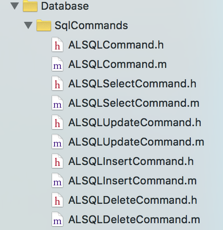

#Patchwork 开发文档

`patchwork`是一个支持 OS X / iOS 开发的基础工具库.  主要包含以下模块：

* Model 映射 
	* JSON Mapping
	* Active Record 	
* 数据库管理
	* 对象化/函数 SQL 操作
	* 多数据库实例管理
	* 数据版本迁移管理
* 虚拟网络接口， 无缝支持各种网络库
	* ASIHTTPRequest (√)
	* NSURLSession (√)
	* ...
* 链式语法

##JSON 对象映射
基于`YYModel`实现， 关于`YYModel`， 参见: https://github.com/ibireme/YYModel, 这里有很详细的单元测试用例。

`YYModel`是一个无侵入性的 JSON Mapping 框架， 不需要继承基类， 通过 NSObject 的 category 来实现。 `patchword` 对 `YYModel` 进行了一些扩展(需要继承`ALModel`). 

###JSON to Model

```ObjC
/// model object
@interface TestCaseUser : ALModel
@property(copy)     NSString    *name;
@property(assign)   NSUInteger   age;
@property(copy)     NSString    *email;
@property(strong)   NSURL       *homepage;
@end

@implementation TestCaseUser

@end

/// json transform test
- (void)testJSONTransform {
    NSString *json = @"{\"name\": \"Alex Lee\", "
                     @"\"age\": 35, "
                     @"\"email\": \"alex***@hotmail.com\", "
                     @"\"homepage\":\"https://github.com/alexlee002\"}";
                     
    TestCaseUser *user = [TestCaseUser modelWithJSON:json];
    XCTAssertEqualObjects(user.name, @"Alex Lee");
    XCTAssertEqualObjects(user.email, @"alex***@hotmail.com");
    XCTAssertEqualObjects(user.homepage, [NSURL URLWithString:@"https://github.com/alexlee002"]);
    XCTAssertEqual(user.age, 35);
}
```

#### 自定义类型转换：
`YYModel`内置了很强大的自动类型转换， 能满足绝大部分需要。
同时为了便于扩展， `YYModel`也提供一些扩展接口：

```ObjC
/**
 This method's behavior is similar to `- (BOOL)modelCustomTransformFromDictionary:(NSDictionary *)dic;`, 
 but be called before the model transform.
 
 @discussion If the model implements this method, it will be called before
 `+modelWithJSON:`, `+modelWithDictionary:`, `-modelSetWithJSON:` and `-modelSetWithDictionary:`.
 If this method returns nil, the transform process will ignore this model.
 
 @param dic  The json/kv dictionary.
 
 @return Returns the modified dictionary, or nil to ignore this model.
 */
- (NSDictionary *)modelCustomWillTransformFromDictionary:(NSDictionary *)dic;

/**
 If the default json-to-model transform does not fit to your model object, implement
 this method to do additional process. You can also use this method to validate the 
 model's properties.
 
 @discussion If the model implements this method, it will be called at the end of
 `+modelWithJSON:`, `+modelWithDictionary:`, `-modelSetWithJSON:` and `-modelSetWithDictionary:`.
 If this method returns NO, the transform process will ignore this model.
 
 @param dic  The json/kv dictionary.
 
 @return Returns YES if the model is valid, or NO to ignore this model.
 */
- (BOOL)modelCustomTransformFromDictionary:(NSDictionary *)dic;

/**
 If the default model-to-json transform does not fit to your model class, implement
 this method to do additional process. You can also use this method to validate the
 json dictionary.
 
 @discussion If the model implements this method, it will be called at the end of
 `-modelToJSONObject` and `-modelToJSONString`.
 If this method returns NO, the transform process will ignore this json dictionary.
 
 @param dic  The json dictionary.
 
 @return Returns YES if the model is valid, or NO to ignore this model.
 */
- (BOOL)modelCustomTransformToDictionary:(NSMutableDictionary *)dic;
```

`-modelCustomWillTransformFromDictionary:` 可以用来 "格式化" Dictionary,  把 Dictionary 转换成可以直接进行 mapping 的Dictionary 格式。

`-modelCustomTransformFromDictionary:` 在`YYModel`完成 JSON 映射之后调用， `ALModel`通过实现这个方法来进行自定义类型转换扩展。 


`-modelCustomTransformToDictionary:` 同上， 在 model 转换成 Dictionary 之后调用， `ALModel`也对这个方法进行扩展。


####JSON value to model property
	
在 model 中实现方法： -modelCustomTransform`PropertyName`From`ClassType`: （在`-modelCustomTransformFromDictionary:`中调用）

eg:

```objc
- (void)modelCustomTransformCurrentTimeFromNSNumber:(NSNumber *)timeInterval {
	self.currentTime = [NSDate dateWithTimeIntervalSince1970:[timeInterval doubleValue]];
}

- (void)modelCustomTransformErrorFromNSString:(NSString *)timeInterval {
	self.error = [NSError error....];
}
```

####model property to JSON

eg:

```Objc
- (void)testModelTransform {
    TestCaseUser *user = [[TestCaseUser alloc] init];
    user.name          = @"Alex Lee";
    user.age           = 20;

    NSDictionary *json = [user modelToJSONObjectWithCustomTransformers:@{
        keypath(user.age) : ^id(NSString *propertyName, id value) {
        if ([value integerValue] < 12) {
            return @"Child";
        } else if ([value integerValue] < 28) {
            return @"Youth";
        } else if ([value integerValue] < 40) {
            return @"Middle age";
        }
        return @"Elder";
        }
        }];
    
    XCTAssertEqualObjects(castToTypeOrNil(json, NSDictionary)[@"age"], @"Youth");
    
}
```

##Active Record
###Model 与数据表的关联

让 Model 与数据表关联， 需要实现以下的方法：

```Objc
#pragma mark - table mappings (override by subclasses)
@interface ALModel (ActiveRecord_Protected)

+ (nullable NSString *)tableName;
+ (nullable NSString *)databaseIdentifier;

+ (nullable NSArray<NSString *> *)ignoreRecordProperties;

// @{propertyName: columnName}
+ (nullable NSDictionary<NSString *, NSString *>  *)modelCustomColumnNameMapper;

//typedef NSComparisonResult (^NSComparator)(ALDBColumnInfo *_Nonnull col1, ALDBColumnInfo *_Nonnull col2)
+ (NSComparator)columnOrderComparator;

+ (void)customColumnDefine:(ALDBColumnInfo *)cloumn forProperty:(in YYClassPropertyInfo *)property;

/**
 *  Custom transform property value to save to database
 *
 *  @return value to save to database
 */
//- (id)customColumnValueTransformFrom{PropertyName};

/**
 *  Custom transform property value from resultSet
 *  @see "-recordsWithCondition:"
 */
//- (void)customTransform{PropertyName}FromRecord:(in FMResultSet *)rs columnIndex:(int)index;

// key: the property name
// specified the model's primary key, if it's not set, "_id" is set as default.
+ (nullable NSArray<NSString *>            *)primaryKeys;
+ (nullable NSArray<NSArray<NSString *> *> *)uniqueKeys;
+ (nullable NSArray<NSArray<NSString *> *> *)indexKeys;

// default is NO, if return YES, prmaryKeys must be set.
+ (BOOL)withoudRowId;

@end
```

`+ tableName` ：返回与 Model 对应的数据表名字， 默认是Model 的名字。

`+ databaseIdentifier`： 返回与 Model 关联的数据库文件路径。

`+ ignoreRecordProperties`： 返回不需要映射到数据表字段的 Model 属性的名字。

`+ modelCustomColumnNameMapper`： 自定义的`{属性名： 数据库字段名}` 映射,  默认会把驼峰命名方式的属性明映射为下划线分割的全小写的字段名, 比如: `fileName`会默认映射为 `file_name`。

`+ customColumnDefine:forProperty:` 自定义 column 信息。

`+primaryKeys` 数据表主键对应的属性名， 一般不需要实现， sqlite 有默认的`rowid`作为主键。

`+uniqueKeys` 数据表唯一索引对应的属性名， 数据表可以有多个唯一索引， 每个唯一索引可以有多个字段。

`+indexKeys` 数据表索引字段对应的属性名。

`+withoudRowId` 是否禁止 sqlite 使用`rowid`作为默认 primary key. 如果返回`YES`, 则`+primaryKeys`不能返回`nil`.

###使用 ActiveRecord

```ObjC
+ (nullable NSArray<__kindof ALModel *> *)modelsWithCondition:(nullable ALSQLCondition *)condition;
+ (ALSQLSelectCommand *)fetcher;

- (BOOL)saveOrReplce:(BOOL)replaceExisted;
- (BOOL)updateOrReplace:(BOOL)replaceExisted;
- (BOOL)updateProperties:(nullable NSArray<NSString *> *)properties repleace:(BOOL)replaceExisted;

- (BOOL)deleteRecord;

+ (BOOL)saveRecords:(NSArray<ALModel *> *)models repleace:(BOOL)replaceExisted;
+ (BOOL)updateProperties:(NSDictionary *)contentValues
           withCondition:(nullable ALSQLCondition *)condition
                repleace:(BOOL)replaceExisted;
+ (BOOL)deleteRecordsWithCondition:(nullable ALSQLCondition *)condition;
```

**Example:**

```ObjC
/// TestUser.h
@interface TestUser : ALModel
@property(PROP_ATOMIC_DEF, copy)  NSString *name;
@property(PROP_ATOMIC_DEF)        NSInteger age;
@property(PROP_ATOMIC_DEF, copy)  NSString *addr;
@end

/// TestUser.m
@implementation TestUser
+ (NSString *)tableName { return @"user"; }
+ (NSString *)databaseIdentifier {
    NSString *path = [NSHomeDirectory() stringByAppendingPathComponent:@"test_1.db"];
    return path;
}

+ (nullable NSDictionary<NSString *, NSString *>  *)modelCustomColumnNameMapper {
    return @{keypathForClass(TestUser, name): @"user_name", keypathForClass(TestUser, addr): @"address"};
}
@end
```

**Search Model**

```ObjC
TestUser *user1 = [TestUser modelsWithCondition:AS_COL(TestUser, age).EQ(@35)].firstObject;
```
等价的 SQL 语句：

```SQL
SELECT rowid, * FROM user WHERE (age = ?)
```
更复杂一点的查询：

```ObjC
NSArray *users = [TestUser fetcher]
                     .WHERE(AS_COL(TestUser, age).GT(@10)
                            .AND(AS_COL(TestUser, age).LT(@"20"))
                            .AND(AS_COL(TestUser, addr).MATCHS_PREFIX(@"Beijing", matchsAny)))
                     .ORDER_BY(DESC_ORDER(AS_COL(TestUser, age)))
                     .ORDER_BY(AS_COL(TestUser, name))
                     .GROUP_BY(AS_COL(TestUser, addr))
                     .OFFSET(5)
                     .LIMIT(10)
                     .FETCH_MODELS();
```
等价 SQL：

```SQL
SELECT rowid, * 
FROM user 
WHERE (age > ?) 
	AND (age < ?) 
	AND (address LIKE ?) 
GROUP BY address 
ORDER BY age DESC, user_name
LIMIT 5, 10
```

**自定义查询：**

```ObjC
sql = [TestUser fetcher]
                    .SELECT(@[ @"COUNT(*)" ])
                    .RAW_WHERE(@"age > ? OR addr LIKE ? GROUP BY name LIMIT 100", @[ @10, @"Beijing%" ])
                    .sql;
XCTAssertEqualObjects(sql, @"SELECT COUNT(*) FROM user WHERE age > ? OR addr LIKE ? GROUP BY name LIMIT 100");


sql = [TestUser fetcher].WHERE(AS_COL(TestUser, age).BIT_AND(@2).EQ(@0)).sql;
XCTAssertEqualObjects(sql, @"SELECT rowid, * FROM user WHERE (age & 2 = ?)");

sql = [TestUser fetcher]
          .SELECT   (@[ AS_COL(TestUser, name) ])
          .WHERE    (AS_COL(TestUser, addr).EQ(@"Beijing"))
          .ORDER_BY (DESC_ORDER(AS_COL(TestUser, name)))
          .ORDER_BY (AS_COL(TestUser, age))
          .OFFSET   (5)
          .LIMIT    (10)
          .sql;
XCTAssertEqualObjects(sql, @"SELECT user_name FROM user WHERE (address = ?) ORDER BY user_name DESC, age LIMIT 5, 10");
```
使用`[ALModel fetcher]`可以实现大部分 `Raw SQL` 的查询功能。

**Insert:**

```ObjC
TestUser *user = [[TestUser alloc] init];
user.name = @"Alex Lee";
user.age = 35;
user.addr = @"Beijing";
[user saveOrReplce:YES];
```
等价于：

```SQL
INSERT OR REPLACE INTO user(user_name, age, address) VALUES(?, ?, ?)
```

**Batch Inserts**

```ObjC
NSInteger count = 10;
NSMutableArray *insertingUsers = [NSMutableArray array];
for (NSInteger i = 0; i < count; ++i) {
    TestUser *user0 = [[TestUser alloc] init];
    user0.age = 30 + i;
    user0.name = [NSString stringWithFormat:@"alex %zd", i];
    user0.addr = [NSString stringWithFormat:@"BJ %zd", i];
    [insertingUsers addObject:user0];
}
[TestUser saveRecords:insertingUsers repleace:YES];
```
批量操作， 会默认开启 `sqlite transaction`, 然后执行 insert 语句， 如果执行过程发生错误， 则 `rollback transaction`, 否则 `commit transaction`.

**Update:**

```ObjC
TestUser *user1 = [TestUser modelsWithCondition:AS_COL(TestUser, age).EQ(@35)].firstObject;
user1.age = 40;
[user1 updateOrReplace:YES];
```
使用下面的方法， 可以更新指定的字段：

```ObjC
- (BOOL)updateProperties:(nullable NSArray<NSString *> *)properties repleace:(BOOL)replaceExisted;
```

**Batch Updates:**

使用下边的方法， 可以实现批量更新多条记录

```ObjC
+ (BOOL)updateProperties:(NSDictionary *)contentValues
           withCondition:(nullable ALSQLCondition *)condition
                repleace:(BOOL)replaceExisted;
```

**Delete:**

```ObjC
TestUser *user1 = [TestUser modelsWithCondition:AS_COL(TestUser, age).EQ(@35)].firstObject;
[user1 deleteRecord];
```
使用下边的方法， 删除多条记录:

```ObjC
+ (BOOL)deleteRecordsWithCondition:(nullable ALSQLCondition *)condition;
```

###进阶 - 如何实现？
####SQLCommand


`ALSQLCommand`对应一个 `SQL` 语句，每一个子类对应一种类型的 `SQL` 语句：`Select`, `Update`, `Insert`, `Delete`。 

我们可以通过创建 `Command` 对象，设置属性的方式来以对象的方式使用 `SQL`, 摆脱手写 `SQL` 的弊端。 开发者只需简单的设置必要的 `Command` 属性， 由 `Command` 来保证生成正确的 `SQL` 语句。

`Model` 对象中的数据持久化操作， 都会生成对应的`Command`.

####SQLCondition
Github 上有好多`Objective-C`和`Swift`的`Active Record`实现， 但是都摆脱不了一个缺陷：查询语句的`WHERE`条件还是需要手写`Raw SQL`:

```ObjC
fetchCondition.sqlite.where = @"name = 'sample1' and price > 50";
fetchCondition.sqlite.orderBy = @"name desc";
```
手写`Raw SQL`虽然灵活， 但是容易写错(比如手误)， 另外`WHERE`中的字段名没法自动映射到 Model 的属性(或者实现起来不太方便)。

`patchwork`通过`ALSQLCondition`对象， 对`WHERE`语句进行对象化封装，很方便的在`Command`中实现复杂的条件查询(详见单元测试`DBConditionsTests.m`)。

Example1:

```ObjC
ALSQLCondition *condition = @"col2".EQ(@4).AND(@"col3".GT(@4)).AND(@"col1".EQ(@"s")).build;

TAssertEqualObjects(condition.sqlClause, @"(col2 = ?) AND (col3 > ?) AND (col1 = ?)");
```

Example2:

```ObjC
NSString *sql = [db.UPDATE([TestUser tableName])
                     .VALUES(
                         @{ AS_COL(TestUser, age) : @20,
                            AS_COL(TestUser, addr) : @"Beijing" })
                     .WHERE(EQ(AS_COL(TestUser, name), @"alex")) sql];
XCTAssertEqualObjects(sql, @"UPDATE user SET age=?, address=? WHERE (user_name = ?)");

sql = db.UPDATE([TestUser tableName])
          .POLICY(kALDBConflictPolicyFail)
          .SET(AS_COL(TestUser, addr), @"Beijing")
          .SET(AS_COL(TestUser, age), @20)
          .WHERE(EQ(AS_COL(TestUser, name), @"alex"))
          .sql;
XCTAssertEqualObjects(sql, @"UPDATE OR FAIL user SET address=?, age=? WHERE (user_name = ?)");
```

##数据迁移 （数据库结构改变）
随着 App 的不断迭代， 数据库结构的修改导致的数据迁移一直是个麻烦的事情。 这方面的解决方案也不外乎两种类型：

* 自动迁移：自动对比设备上当前数据表结构和 App 最新版本 Model 的差别， 自动添加新的 column (sqlite不支持删除 column)， 自动修改column 类型和索引类型(sqlite 不支持修改 primary key)
	* 优势：自动完成， 无需编程实现。
	* 劣势：难以实现渐进式迁移。  
* 手动迁移：记录数据库每次修改的版本号。 对比设备当前版本和 App 指定的数据库版本， 可以实现按版本逐步迁移。
	* 优势：可以精确控制迁移的每个步骤
	* 劣势：需要编程实现版本迁移。

考虑到更好的适应性和兼容性， `patchwork`采用手动迁移的方式。 

**ALDBMigrationProtocol**

```ObjC
@class FMDatabase;
@protocol ALDBMigrationProtocol <NSObject>

- (BOOL)canMigrateDatabaseWithPath:(NSString *)path;
- (NSInteger)currentVersion;

- (BOOL)setupDatabase:(FMDatabase *)db;
- (BOOL)migrateFromVersion:(NSInteger)fromVersion to:(NSInteger)toVersion databaseHandler:(FMDatabase *)db;

@end
```

要实现数据版本迁移， 我们需要实现`ALDBMigrationProtocol`协议。 

`-canMigrateDatabaseWithPath:` 是否可以处理指定路径数据库的迁移。

`-currentVersion` 当前 App 对应的数据库版本号

`-setupDatabase:` 创建最新版本的数据库结构(该方法未来会被废弃， 由`patchwork`自动完成)

`-migrateFromVersion:to:databaseHandler:`   实现指定版本之间的数据迁移(建议按版本号渐进式迁移)。

##Network

发送网络请求：

```ObjC
[[ALHTTPRequest
    requestWithURLString:@"http://www.baidu.com"
                  method:ALHTTPMethodGet
              completion:^(ALHTTPResponse *_Nonnull response, NSError *_Nullable error, NSUInteger identifier){
                  NSLog(@"%@", response.responseString);
              }] send];
```

download request:

```ObjC
[[ALHTTPRequest
     requestWithURLString:@"http://shouji.baidu.com/download/baiduinput_mac_v3.4_1000e.dmg"
                   method:ALHTTPMethodGet
               completion:^(ALHTTPResponse *_Nonnull response, NSError *_Nullable error, NSUInteger identifier) {
                   NSLog(@"download complete!");
               }]
        .SET_PROPERTY(keypathForClass(ALHTTPRequest, type), @(ALRequestTypeDownload))
        .SET_PROPERTY(
            keypathForClass(ALHTTPRequest, progressBlock),
            ^(uint64_t bytesDone, uint64_t totalBytesDone, uint64_t totalBytesExpected, NSUInteger identifier) {
                NSLog(@"%.2f%% completed!", totalBytesDone * 100.f / totalBytesExpected);
            }) send];
```

自动解析 JSON 数据：

```ObjC
/// Model
@interface GithubUser : ALModel<YYModel>
@property(copy)     NSString    *login;
@property(copy)     NSString    *ID;
@property(strong)   NSURL       *url;
@property(copy)     NSString    *name;
@property(copy)     NSString    *location;
@property(strong)   NSDate      *createdAt;
@end

@implementation GithubUser
+ (NSDictionary *)modelCustomPropertyMapper {
    return @{keypathForClass(GithubUser, ID): @"id", keypathForClass(GithubUser, createdAt): @"created_at"};
}
@end

/// request
[[ALHTTPRequest requestWithURLString:@"https://api.github.com/users/alexlee002"
                             method:ALHTTPMethodGet
                 responseModelClass:[GithubUser class]
                         completion:^(id _Nullable responseModel, NSError *_Nullable error, NSUInteger identifier){
                             NSLog(@"user model: %@", [responseModel yy_modelDescription]);
                         }] send];
```
输出：

```
2016-03-29 14:34:18.586 patchwork-Demo-iOS[21558:513099] user model: <GithubUser: 0x7ffe6af530c0> {
    ID = "576164";
    createdAt = 2011-01-21 09:35:06 +0000;
    location = "Beijing";
    login = "alexlee002";
    name = "Alex Lee";
    url = https://api.github.com/users/alexlee002
}
```


